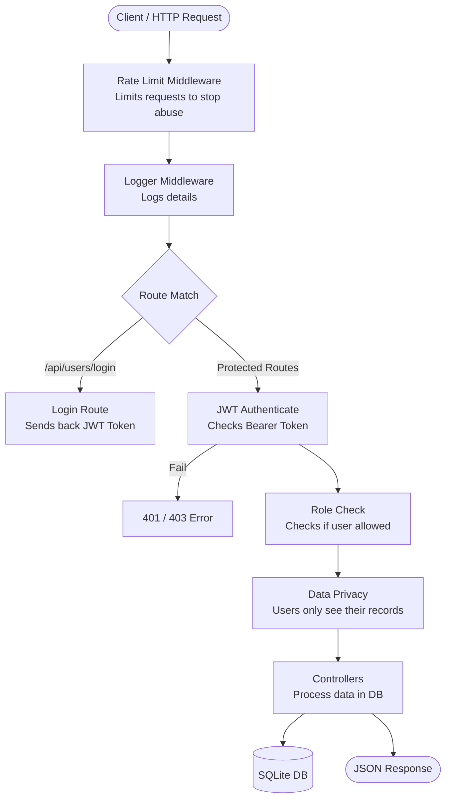

# Financial Dashboard API


A lightweight REST API built with Node.js and Express for tracking personal or organizational finances. It handles income/expense records, gives you dashboard-level summaries (monthly trends, category breakdowns, recent activity), and has a basic role-based access system so not everyone can go around deleting things.

Data is stored in SQLite .
I added Swagger using AI for better API  understanding .
---

## What it does

- **Users** — create accounts, assign roles (`viewer`, `analyst`, `admin`), activate/deactivate them
- **Records** — log income or expense entries with category, date, amount, and optional notes
- **Dashboard** — aggregated views: total income vs expense, category breakdowns, monthly/weekly trends, recent activity
- **Auth** — header-based user identification (`userid`), with role checks on protected routes
- **Validation** — all incoming request bodies are validated with Zod before hitting the database
- **Swagger** — interactive API docs at `/api-docs`

---

## Request Flow



---

## Assumptions and Tradeoffs

### Assumptions
- **User Privacy**: We assume "privacy" means you only see your own money records. Only Admins can see everything.
- **Login**: We use email to login since we don't have passwords yet.
- **Roles**: We assume `admin` has full control, while `viewer` and `analyst` can only read their own data.

### Tradeoffs
- **SQLite**: Used for easy setup, but it might get slow with millions of records.
- **Token Secret**: Secret is inside the code for simplicity, though in a real app it belongs in an environment file.
- **Soft Delete**: Records stay in the database even when "deleted". This is safer but uses more disk space.

---

## Tech Stack

| Layer | Tech |
|---|---|
| Runtime | Node.js |
| Framework | Express v5 |
| Security | Rate Limiting + JWT Tokens |
| Database | SQLite |
| Validation | Zod |
| Documentation| Swagger |

---

## Project Structure

```
├── index.js                    # Server start + global security (Rate Limit)
└── src/
    ├── config/
    │   ├── db.js               # Database setup + Soft Delete columns
    │   └── swagger.js          # API documentation config
    ├── controllers/
    │   ├── record.controller.js      # Record logic + Owner filtering 
    │   └── user.controller.js        # User logic + JWT Login
    ├── middlewares/
    │   ├── auth.middleware.js         # JWT Token verification
    │   ├── logger.middleware.js       # Basic logging
    │   └── validate.middleware.js     # Zod data check
    ├── routes/
    │   ├── index.js                   # Main route folder
    │   ├── record.routes.js           # Money record routes
    │   └── user.routes.js             # User and Login routes
    └── validators/
        ├── record.validator.js        # Data rules for records
        └── user.validator.js          # Data rules for users
```

---

## Getting Started

### Prerequisites

- Node.js v18+
- npm

### Install & Run

```bash
# Clone the repo
git clone https://github.com/user-no-18/Financial-Dashboard.git
cd Financial-Dashboard

# Install dependencies
npm install

# Start development server (with auto-reload)
npm run dev

# Or just start it normally
npm start
```

Server starts on `http://localhost:3000` by default.  
Swagger docs: `http://localhost:3000/api-docs`  
Raw Swagger Definition: `http://localhost:3000/swagger.json`  

---

## Sharing Swagger Docs

To share the documentation with others, you have two options:
1.  **Direct Link**: If your server is deployed, share the `/api-docs` link.
2.  **Export JSON**: Send them the `/swagger.json` URL or download the file and send it. They can then import it into:
    - [Postman](https://www.postman.com/) (Import -> Link/File)
    - [Swagger Editor](https://editor.swagger.io/) (File -> Import URL/File)

---

## API Overview

All routes live under `/api`. Protected routes require a `userid` header with a valid user ID.

### Users — `/api/users`

| Method | Endpoint | Auth | Role | Description |
|---|---|---|---|---|
| POST | `/api/users` | No | — | Create a new user |
| GET | `/api/users` | Yes | admin | List all users |
| GET | `/api/users/:id` | Yes | admin | Get user by ID |
| PATCH | `/api/users/:id/role` | Yes | admin | Update user role |
| PATCH | `/api/users/:id/status` | Yes | admin | Activate / deactivate user |
| DELETE | `/api/users/:id` | Yes | admin | Delete user + their records |

### Records — `/api/records`

| Method | Endpoint | Auth | Role | Description |
|---|---|---|---|---|
| POST | `/api/records` | Yes | admin | Create a financial record |
| GET | `/api/records` | Yes | all roles | List records (filterable) |
| GET | `/api/records/:id` | Yes | all roles | Get a single record |
| PUT | `/api/records/:id` | Yes | admin | Update a record |
| DELETE | `/api/records/:id` | Yes | admin | Delete a record |

**GET /api/records query params:** `type`, `category`, `startDate`, `endDate`

### Dashboard — `/api/dashboard`

| Method | Endpoint | Auth | Description |
|---|---|---|---|
| GET | `/api/dashboard/summary` | Yes | Total income, expenses, net balance |
| GET | `/api/dashboard/categories` | Yes | Breakdown by type + category |
| GET | `/api/dashboard/recent` | Yes | Last 10 records |
| GET | `/api/dashboard/trends/monthly` | Yes | Monthly income vs expense |
| GET | `/api/dashboard/trends/weekly` | Yes | Weekly income vs expense |

---

## Auth Model

We use **JWT Tokens** for security. Login at `/api/users/login` to get a token. Then pass it in the header like this:

```
Authorization: Bearer YOUR_TOKEN_HERE
```

Three roles exist:

| Role | What they can do |
|---|---|
| `viewer` | Read their own records and dashboard data |
| `analyst` | Read their own records and dashboard data |
| `admin` | Everything — manage all records and all users |

---


