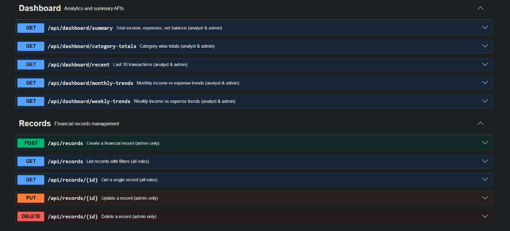
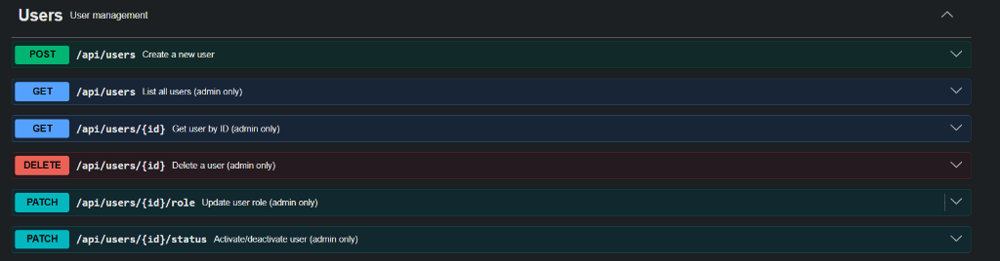
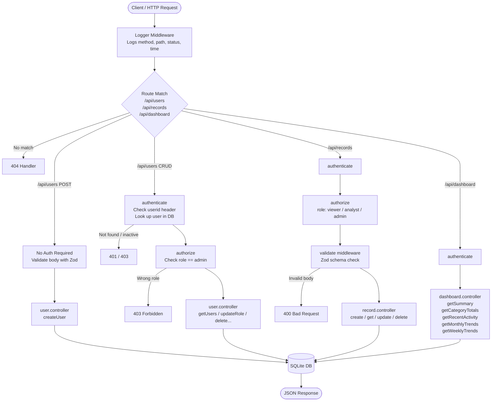

# Financial Dashboard API





A lightweight REST API built with Node.js and Express for tracking personal or organizational finances. It handles income/expense records, gives you dashboard-level summaries (monthly trends, category breakdowns, recent activity), and has a basic role-based access system so not everyone can go around deleting things.

Data is stored in SQLite — no external database setup needed, just clone and run.

---

## What it does

- **Users** — create accounts, assign roles (`viewer`, `analyst`, `admin`), activate/deactivate them
- **Records** — log income or expense entries with category, date, amount, and optional notes
- **Dashboard** — aggregated views: total income vs expense, category breakdowns, monthly/weekly trends, recent activity
- **Auth** — header-based user identification (`userid`), with role checks on protected routes
- **Validation** — all incoming request bodies are validated with Zod before hitting the database
- **Swagger** — interactive API docs at `/api-docs`

---

## Tech Stack

| Layer | Tech |
|---|---|
| Runtime | Node.js |
| Framework | Express v5 |
| Database | SQLite (via `sqlite3`) |
| Validation | Zod |
| API Docs | Swagger (swagger-jsdoc + swagger-ui-express) |
| Dev server | Nodemon |

---

## Project Structure

```
├── index.js                    # App entry point, middleware setup, server start
└── src/
    ├── config/
    │   ├── db.js               # SQLite connection + table initialization
    │   └── swagger.js          # Swagger config
    ├── controllers/
    │   ├── dashboard.controller.js   # Summary, trends, category totals
    │   ├── record.controller.js      # CRUD for financial records
    │   └── user.controller.js        # CRUD for users + role/status management
    ├── middlewares/
    │   ├── auth.middleware.js         # authenticate + authorize functions
    │   ├── logger.middleware.js       # Request logger
    │   └── validate.middleware.js     # Zod validation wrapper
    ├── routes/
    │   ├── index.js                   # Mounts all route groups under /api
    │   ├── dashboard.routes.js
    │   ├── record.routes.js
    │   └── user.routes.js
    └── validators/
        ├── record.validator.js        # Zod schemas for record endpoints
        └── user.validator.js          # Zod schemas for user endpoints
```

---

## Request Flow



---

## Getting Started

### Prerequisites

- Node.js v18+
- npm

### Install & Run

```bash
# Clone the repo
git clone https://github.com/user-no-18/Financial-Dashboard.git
cd Financial-Dashboard

# Install dependencies
npm install

# Start development server (with auto-reload)
npm run dev

# Or just start it normally
npm start
```

Server starts on `http://localhost:3000` by default.  
Swagger docs: `http://localhost:3000/api-docs`  
Raw Swagger Definition: `http://localhost:3000/swagger.json`  

---

## Sharing Swagger Docs

To share the documentation with others, you have two options:
1.  **Direct Link**: If your server is deployed, share the `/api-docs` link.
2.  **Export JSON**: Send them the `/swagger.json` URL or download the file and send it. They can then import it into:
    - [Postman](https://www.postman.com/) (Import -> Link/File)
    - [Swagger Editor](https://editor.swagger.io/) (File -> Import URL/File)

---

## API Overview

All routes live under `/api`. Protected routes require a `userid` header with a valid user ID.

### Users — `/api/users`

| Method | Endpoint | Auth | Role | Description |
|---|---|---|---|---|
| POST | `/api/users` | No | — | Create a new user |
| GET | `/api/users` | Yes | admin | List all users |
| GET | `/api/users/:id` | Yes | admin | Get user by ID |
| PATCH | `/api/users/:id/role` | Yes | admin | Update user role |
| PATCH | `/api/users/:id/status` | Yes | admin | Activate / deactivate user |
| DELETE | `/api/users/:id` | Yes | admin | Delete user + their records |

### Records — `/api/records`

| Method | Endpoint | Auth | Role | Description |
|---|---|---|---|---|
| POST | `/api/records` | Yes | admin | Create a financial record |
| GET | `/api/records` | Yes | all roles | List records (filterable) |
| GET | `/api/records/:id` | Yes | all roles | Get a single record |
| PUT | `/api/records/:id` | Yes | admin | Update a record |
| DELETE | `/api/records/:id` | Yes | admin | Delete a record |

**GET /api/records query params:** `type`, `category`, `startDate`, `endDate`

### Dashboard — `/api/dashboard`

| Method | Endpoint | Auth | Description |
|---|---|---|---|
| GET | `/api/dashboard/summary` | Yes | Total income, expenses, net balance |
| GET | `/api/dashboard/categories` | Yes | Breakdown by type + category |
| GET | `/api/dashboard/recent` | Yes | Last 10 records |
| GET | `/api/dashboard/trends/monthly` | Yes | Monthly income vs expense |
| GET | `/api/dashboard/trends/weekly` | Yes | Weekly income vs expense |

---

## Auth Model

There's no JWT or session stuff right now — authentication is done by passing a `userid` header with every request. The middleware looks up that ID in the database and attaches the user to `req.user`.

```
userid: 1
```

Three roles exist:

| Role | What they can do |
|---|---|
| `viewer` | Read records and dashboard data |
| `analyst` | Read records and dashboard data |
| `admin` | Everything — create/update/delete records and users |

---

## Environment Variables

You can create a `.env` file in the root if you want to override the port:

```env
PORT=3000
```

---

## Notes

- The SQLite database file (`database.sqlite`) is created automatically on first run and is excluded from git.
- SQLite week numbers start at 0, so week-based grouping in trends uses `%W` (Sunday as first day).
- Deleting a user cascades to their records — handled manually in the controller since SQLite FK constraints aren't always on by default.
